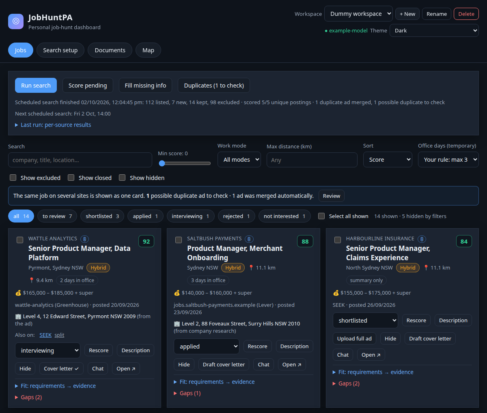
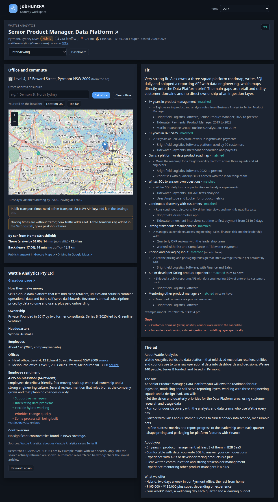
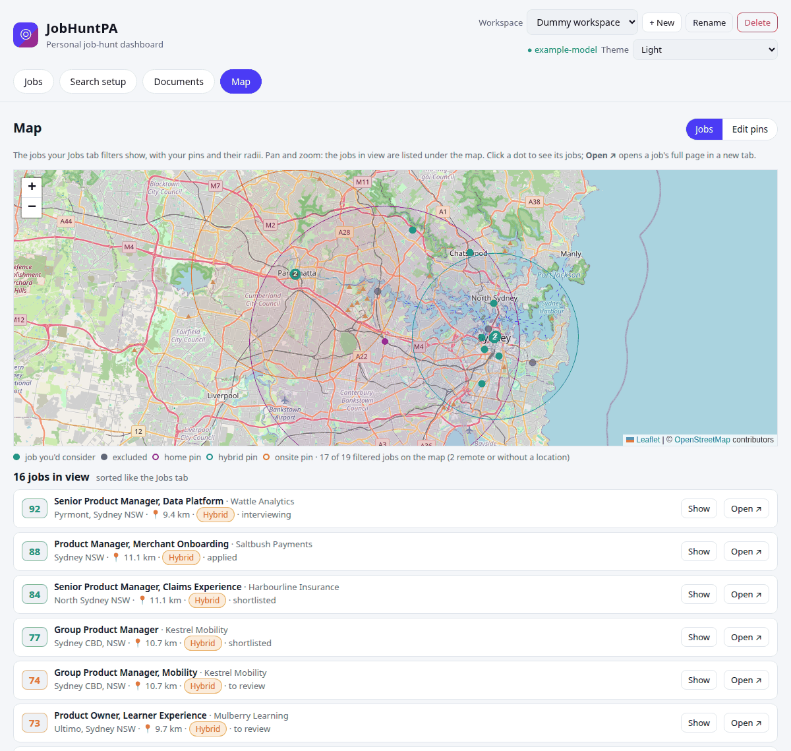
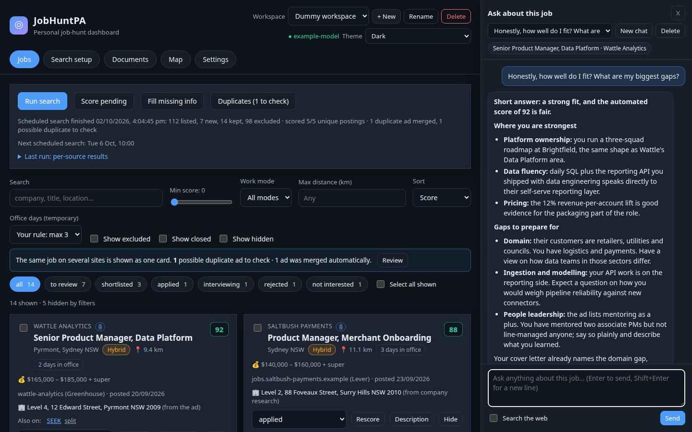
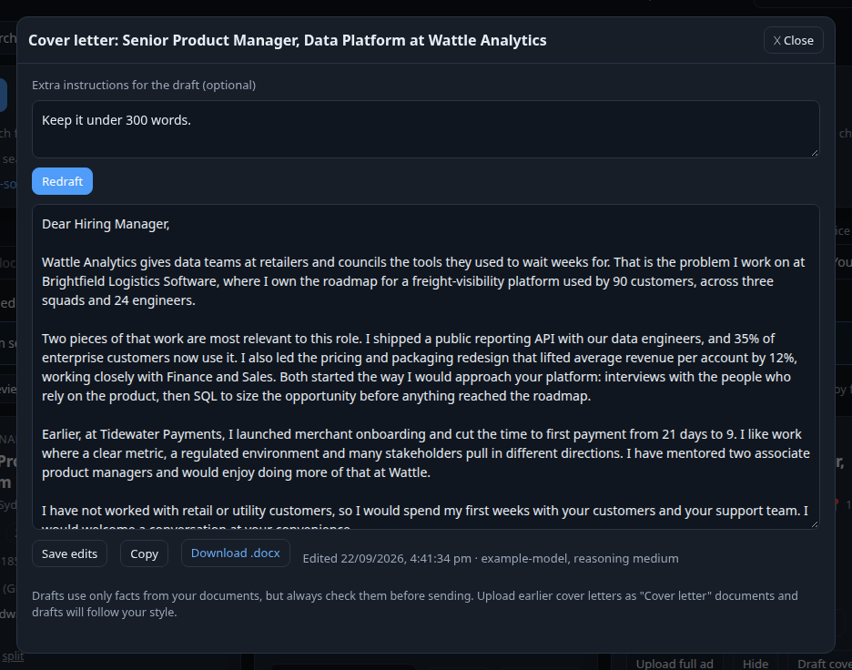
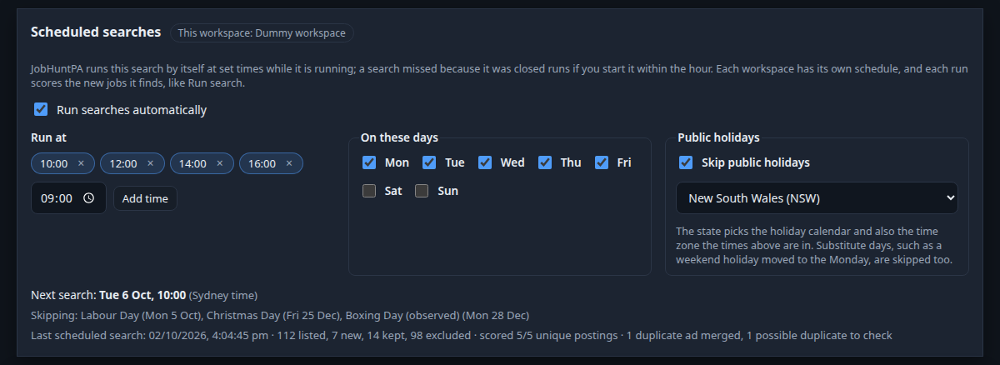
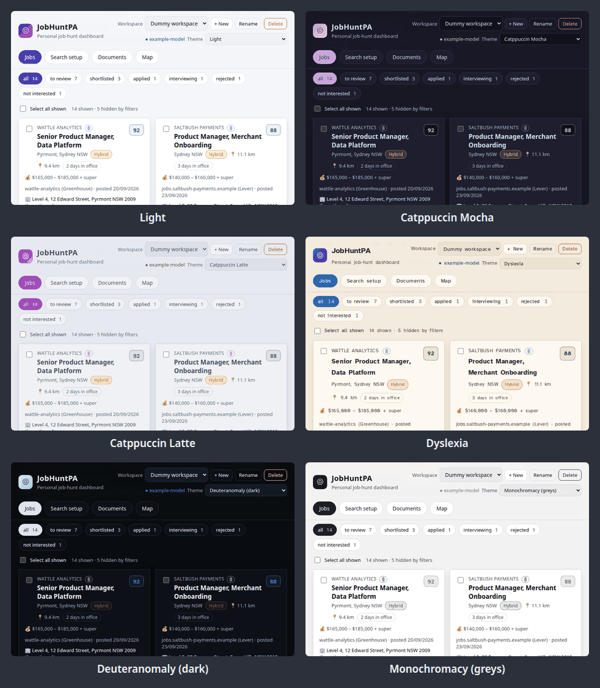
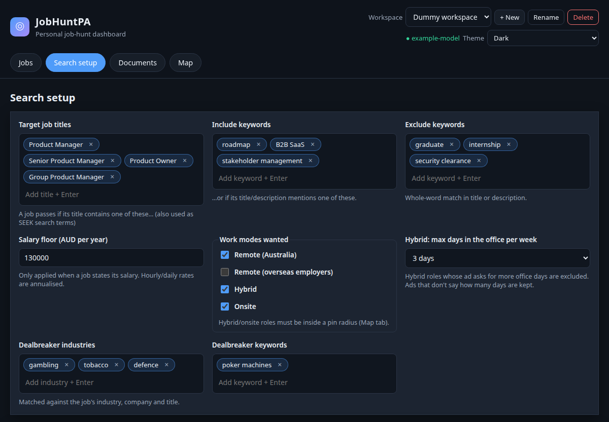
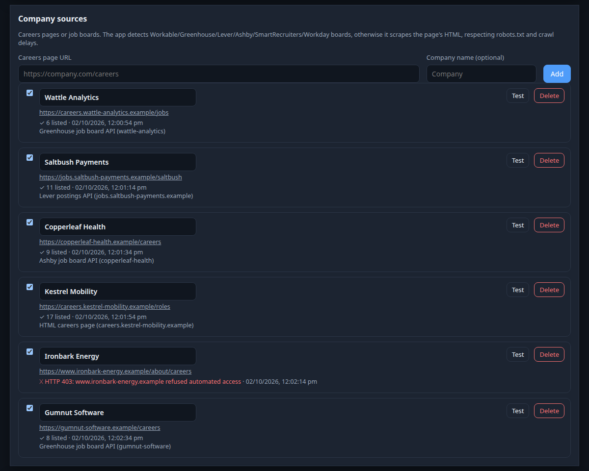
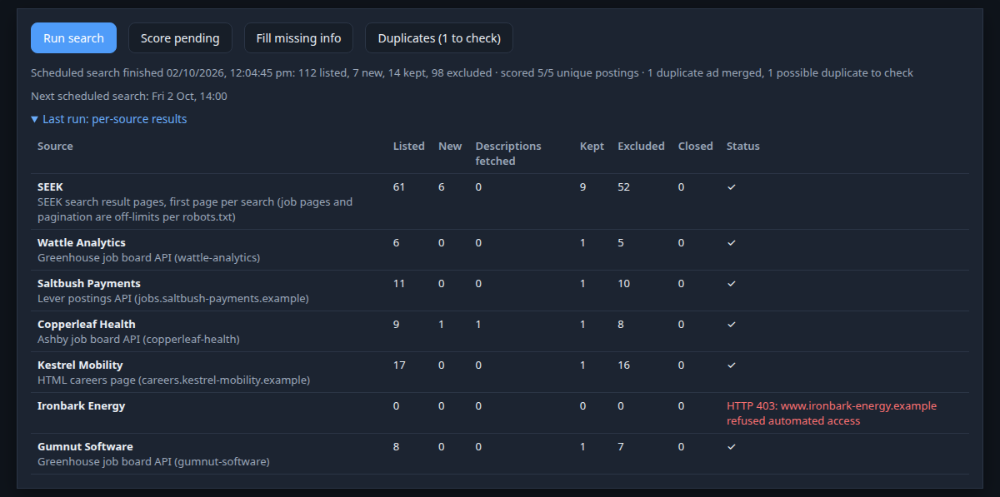

> [!WARNING]
> This was vibe-coded in its entirety, as a way to get experience with LLM-based
> development (and save my sanity while job hunting).
> 
> I'm making this public so I can more easily share this with friends who are also job hunting.
> This is provided as is with no warranty. Do whatever you want with this, but don't come crying to
> me if it doesn't work. It's a vibe-coded throwaway tool --- nothing more.

# JobHuntPA

A personal job search dashboard that runs on your own computer. It collects jobs from SEEK and
company careers pages, filters them against your search settings and map pins, scores the rest
against your CV with an AI model of your choice, drafts cover letters, suggests job titles to
search for, researches each employer, merges the same job advertised on several sites into one,
and lets you chat with the AI about any job.

*All screenshots show a made-up job hunt in a demo workspace: the person, companies and ads are fictional.*

## A quick look

**A job's full page** (*Open ↗* on any job): the office on a map with the commute there and back,
how well the job fits your CV and where the gaps are, what company research found about the
employer, and the whole ad.

**Map**: the jobs your filters show, your pins with their radii, and the jobs in view listed
underneath.

**Chat about a job**: ask how well you fit, what to prepare for an interview, or compare jobs.

**Cover letter drafts** from your own documents, to edit, copy or download as a Word file.

**Scheduled searches**: the search runs by itself at set times on workdays, skipping public holidays.

**Themes**: Dark (above), Light, the Catppuccin flavours, a dyslexia-friendly theme and themes for
colour vision deficiencies.

More: search setup, company sources and the per-source run report

## What you need

- A computer running Windows 10/11, macOS or Linux, and an internet connection.
- An **API key for an AI model (LLM)** that offers an OpenAI-compatible API, for example the
  [Meta Model API](https://dev.meta.ai/) (Muse Spark) or [OpenAI](https://platform.openai.com/).
  Setup asks for three things: the provider's API address, the model name and your key. Using the
  model costs money on your provider account. The app still collects and filters jobs without a
  key, but scoring, cover letters, title suggestions and company research need one.

Setup takes about 5-10 minutes and needs no technical knowledge. Everything stays on your
computer: your documents, jobs and API key are never uploaded anywhere except the requests the
app makes to your chosen AI provider.

## Install on Windows

1. Go to the [latest release](https://github.com/florian3706/JobHuntPA/releases/latest) and
   download **JobHuntPA-Setup.exe**.
2. Double-click it. Windows may say *"Windows protected your PC"* because the program isn't
   signed: click **More info**, then **Run anyway**.
3. Press Enter to accept the install folder, then answer the questions about your AI provider.
   Setup installs Python for you if needed (no admin rights required).
4. When it finishes, start JobHuntPA from the **JobHuntPA** shortcut on your Desktop or in the Start
   menu. A window opens with the app's messages and your browser opens the dashboard. Keep that
   window open while you use JobHuntPA; close it to stop the app.

## Install on macOS

1. On this page click the green **Code** button, then **Download ZIP**, and unzip it (for example
   into your Documents folder).
2. In the unzipped folder, **right-click `Setup.command` and choose Open** (the first time macOS
   asks whether you're sure, because it was downloaded: click **Open**).
3. Follow the questions in the Terminal window. If Python is missing, setup offers to install it
   with Homebrew or opens the python.org download page; install it and run `Setup.command` again.
4. Start JobHuntPA by double-clicking **`Start JobHuntPA.command`**. Keep the Terminal window
   open while you use it; close it to stop the app.

If double-clicking doesn't work: open Terminal, type `cd ` (with a space), drag the folder into
the window, press Enter, then run `./setup.sh` once and `./start.sh` to start.

## Install on Linux

1. Download the ZIP (green **Code** button, then **Download ZIP**) and unzip it, or
   `git clone https://github.com/florian3706/JobHuntPA.git`.
2. Open a terminal in the folder and run `./setup.sh`. If Python 3.10+ or its `venv` module is
   missing, setup shows the command to install it and offers to run it.
3. Start JobHuntPA from your applications menu (setup adds it) or with `./start.sh`.

## Using it

The dashboard opens at http://127.0.0.1:8000. Start in **Search setup** (job titles, keywords,
salary, work modes and company careers pages), upload your CV under **Documents**, drop pins for
where you can commute on the **Map**, then click **Run search** on the Jobs tab. Separate searches
can live in their own **workspaces** (switcher at the top right).

- **Scheduled searches** (Search setup > Scheduled searches): the search runs by itself at 10:00,
  12:00, 14:00 and 16:00 Monday to Friday, skipping public holidays, including substitute days
  (a holiday that falls on a weekend moves to the Monday). Change the times and days, or switch it
  off, per workspace. Pick your state: it sets which public holidays apply and the time zone of the
  times. Searches only run while JobHuntPA is running; a search missed because it was closed runs
  if you start it within the hour. Each run scores the new jobs it finds, like **Run search**.
- **Tracking and tidying**: set each job's status (to review, shortlisted, applied, interviewing,
  rejected, not interested). Tick jobs, or filter the list and tick **Select all shown**, to change
  status or **Hide** them in bulk (only jobs on screen are ever affected); hidden jobs stay hidden when a search finds them again, aren't scored or
  researched, and come back with *Show hidden*.
- **Softening the office-days rule**: if you set a maximum number of office days for hybrid roles,
  the Jobs tab's **Office days (temporary)** menu lets you allow extra days (up to 5) for now. Jobs that
  only that rule excluded reappear, marked *shown by temporary +N office days*, and **Score them**
  scores any that were never scored. Nothing is saved: *Back to my rule*, reloading the page or
  switching workspace restores your saved limit.
- **Government jobs**: Australian Public Service jobs come from APSJobs. Add a source such as
  `https://www.apsjobs.gov.au/s/job-search?department=Services%20Australia` (the agency name as
  APSJobs lists it) or `...?searchString=product%20manager` for a search across all agencies.
  Careers pages that publish an RSS feed (e.g. SBS) can be added by the feed's URL.
- **Full SEEK ads**: SEEK jobs marked *summary only* have an **Upload full ad** button. Save the
  ad's page from SEEK in your browser and upload it to score the job on the whole ad.
- **Suggested job titles** (Documents tab): the AI reads your documents and suggests titles to
  search for; add them to the current search or start a new workspace with them.
- **Cover letters**: *Draft cover letter* on any job writes a first draft from your documents
  (upload earlier cover letters as "Cover letter" documents to match your style). Edit it, then
  copy it or download it as a Word file. Always check it before sending.
- **Chat about jobs**: *Chat* on a job (or tick several and click **Chat about N jobs**) opens a
  chat on the right. The AI sees the ads, your documents, the fit assessment, the company info and
  any cover-letter draft, so you can ask what the role really involves, how to handle your gaps,
  what to ask in an interview, or which of several jobs suits you best. Tick *Search the web* for
  things your saved data doesn't cover (news, salaries); the pages it used are listed under the
  answer. Chats are saved per job set; *New chat* starts over.
- **Duplicate ads**: the same job advertised on several sites (say SEEK and the employer's own
  careers page) becomes one card, with the other sites under *Also on*. The app merges ads it's
  sure about after each search and lists the doubtful ones under **Duplicates** for you to decide
  (*Same job: merge* / *Different jobs*). Your status, cover letter and score carry over to the
  merged card. *split* under *Also on* undoes a merge; **Merge as one job** (tick two or more
  jobs) merges ads the app missed.
- **Job page**: *Open ↗* on a job opens it in a new tab: the whole ad, the fit and gaps, a map of
  the office, the company profile, and the commute there and back at peak times (arriving by 9:00,
  leaving at 17:00 on a Tuesday; change these under Search setup > Commute). Public transport is
  planned from the stations you list there (e.g. Hornsby Station, Asquith Station), including
  changes, metro, buses and walking at the other end; driving starts at your home pin. See
  [Commute times](#commute-times-optional) for the two free keys this needs.
- **Map**: two modes. **Jobs** shows the jobs your Jobs tab filters show, with your pins and their
  radii, and lists the jobs in view under the map (click a dot or **Open ↗** for a job's full
  page in a new tab); nothing can be changed by accident. **Edit pins** drops a pin where you
  click (drag to move); *Only list pins in view* shortens the pin list to the area on screen.
- **Office locations**: most ads only say "Sydney NSW". Instead of assuming the CBD, such jobs show
  **office unknown** until the office is found: the scorer reads it from the full ad, and company
  research (**Fill missing info**) finds the employer's office addresses. An office named in the ad
  wins; otherwise, with several offices in that city, the one closest to your commute pins is used
  (you can pick another on the job page). Recruitment agencies rarely name the client, so their ads are left to you: on the job
  page set the office (address or suburb, or one of the employer's offices), or make the call with
  **Location OK** / **Too far**. The office then drives the location filter and distance.
- **Themes** (top right, remembered per browser): Dark (the default), Light, or *System* to follow
  your computer; the four Catppuccin flavours; a **Dyslexia** theme (warm low-glare background,
  Atkinson Hyperlegible font, wider letter and word spacing) in light and dark; and colour-vision
  themes (Protanomaly, Deuteranomaly, Tritanomaly, Dichromacy, Monochromacy), each in light and
  dark. They're ported from ProjectTimeline; labels always accompany colours, so nothing relies on
  colour alone.
- **Reasoning level** (Search setup > LLM): how long the AI thinks, set separately for scoring,
  cover letters, company research and job chat. *Detect supported levels* shows what your model accepts.

## Updating

- **Windows:** download the newest JobHuntPA-Setup.exe and run it again with the same folder.
- **macOS/Linux:** download the new ZIP and copy its contents over your folder (or `git pull`),
  then run setup again.

Your settings, documents, jobs and API key are kept.

## Changing your AI provider or key

Run setup again with `--reconfigure` (macOS/Linux: `./setup.sh --reconfigure`; Windows: run
JobHuntPA-Setup.exe again and edit the `.env` file in the install folder), or edit the `.env` file
in the app folder directly: `LLM_API_KEY`, `LLM_BASE_URL`, `LLM_MODEL`. Restart the app afterwards.

## Commute times (optional)

The commute on each job's page uses two free services; setup asks for their keys (press Enter to
skip), or add them to `.env` later and restart the app:

- `TFNSW_API_KEY`: public transport in NSW. Sign up at https://opendata.transport.nsw.gov.au,
  create an application, and copy its API key. Without it the page shows driving only.
- `TOMTOM_API_KEY`: driving times with peak-hour traffic. Sign up at
  https://developer.tomtom.com and copy the default key. Without it, driving times come from
  OSRM's public server and ignore traffic (the page says so).

## Uninstalling

Close JobHuntPA first, then:

- **Windows:** *Settings > Apps > Installed apps > JobHuntPA > Uninstall*, or the Start-menu
  shortcut **Uninstall JobHuntPA**.
- **macOS:** double-click **`Uninstall JobHuntPA.command`** in the app folder (right-click > Open
  the first time).
- **Linux:** run `./uninstall.sh` in the app folder.

The uninstaller first offers to save a **backup** (your jobs, documents, workspaces, settings and
API key) as `JobHuntPA-backup-<date>.zip` in your Documents folder. It then removes the shortcuts
and the app folder. It asks before removing the shared browser component, and leaves Python
installed because other programs may use it. To restore a backup, install JobHuntPA again and
unzip the backup into the new app folder.

## Troubleshooting

- **The browser shows nothing:** check the JobHuntPA window for error messages. If it says
  another copy is running, use that one, or restart your computer.
- **"LLM not configured" in the app:** your API settings are missing; see *Changing your AI
  provider or key*.
- **Some company sites return no jobs:** they may block automated access or need the browser
  component; setup's step 3 installs it. On Linux you can fix a failed browser install with
  `.venv/bin/python -m playwright install --with-deps chromium`.

## For developers

Setup lives in one place, `installer/installer.py` (standard library only), called by `setup.sh`
(Linux/macOS) and by `JobHuntPA-Setup.exe` (`installer/windows_setup.py`). Removal is
`installer/uninstaller.py`, called by `uninstall.sh` and built into `JobHuntPA-Uninstall.exe`. Starting goes through
`installer/launch.py`, called by `start.sh` and `JobHuntPA.exe` (`installer/windows_launch.py`).
**Any change to dependencies, configuration, data folders or how the app starts must update
these scripts**; `.github/workflows/ci.yml` runs the real setup and launch on Linux, macOS and
Windows on every push to catch breakage.

Manual run: `python3 -m venv .venv && .venv/bin/pip install -r requirements.txt`, copy
`.env.example` to `.env`, then `.venv/bin/python installer/launch.py`. Tests:
`python3 -m unittest discover -s tests -t .`

**README screenshots:** `python3 tools/readme_screenshots.py` (needs `pip install pillow`) builds a
throwaway database of made-up data with `tools/demo_data.py`, runs the app on it with fake AI
settings and no scheduler, and saves `docs/screenshots/*.png`. It never touches `data/` or `.env`.
Re-run it after changing the UI; `--only jobs,map` retakes just those.

**Releasing the Windows programs:** bump `VERSION`, commit, then `git tag v$(cat VERSION) && git
push --tags`. `.github/workflows/release.yml` builds JobHuntPA-Setup.exe and JobHuntPA.exe on
Windows and attaches them to a GitHub Release. The setup program downloads the source of its own
tag, so the tag must exist on GitHub.

## How a search run works

`Run search` starts a background run (`backend/tasks.py`); the page polls its progress.
`backend/schedule.py` starts the same run at each workspace's scheduled times (public holidays
from the `holidays` package); runs never overlap, so a due search waits up to an hour for a
busy one.

1. **Listing** (`backend/adapters/`): SEEK search pages, then each enabled company source. A
   source URL is resolved in order: an APSJobs search URL (`apsjobs.py`); a known ATS board
   (Workable, Greenhouse, Lever, Ashby, SmartRecruiters, Workday) in the URL or linked from the
   page; an RSS/Atom job feed; schema.org `JobPosting` data; HTML job links with pagination;
   headless-browser rendering for JavaScript-only pages. Sites that answer with a bot check
   (Cloudflare, AWS WAF) are reported as errors, never bypassed.
2. **Caching** (`backend/pipeline.py`): jobs are upserted by URL. A job stored with a full
   description is never fetched again. Listing pages are cached 30-60 minutes in `http_cache`.
   Detail pages are fetched only for new jobs that pass the cheap filters, at most 60 per source
   per run (the rest follow on the next run).
3. **Filtering** (`backend/filters.py`): dealbreakers, titles/keywords, salary floor, work mode,
   location pins. Excluded jobs stay in the DB with a reason ("Show excluded"). The office-days
   limit can be softened temporarily (`softened_job_ids`, `?office_slack=N` on the jobs and
   scoring endpoints) without changing stored exclusions.
4. **Duplicates** (`backend/duplicates.py`): jobs are compared in pairs (blocked by employer
   name and title words). Sure duplicates are merged: the copy with the best data stays listed and
   the others get `duplicate_of`, keeping their rows so later searches recognise their URLs.
   Doubtful pairs are stored in `job_duplicates` as suggestions; the user's "different jobs"
   answers are kept there too and never suggested again.
5. **Scoring** (`backend/scorer.py`): new jobs that passed the filters are scored (merged copies
   aren't). The scorer also reports the office named in the ad (`backend/offices.py`); an ad that
   names only a city keeps the city's coordinates and is flagged "office unknown". Failures are stored as errors (not as 0) and retried next time. A rejected API key
   stops the batch after one request.

## Scraping rules

- Every request goes through `backend/scraping/http.py`: robots.txt is checked for every URL
  (wildcards, longest match), `Crawl-delay` is honoured (at least 2 s per host), and the
  User-Agent identifies the app honestly. There is no browser impersonation, and blocks and
  CAPTCHAs are never worked around.
- SEEK's robots.txt allows search result pages but not job pages, so SEEK jobs carry the listing
  summary only. For a job you care about, click **Upload full ad** on its card: open the ad on
  SEEK, save the page (Ctrl+S / Cmd+S) and upload the file; the job is updated with the full ad,
  re-filtered and rescored. SEEK may also refuse automated access outright (HTTP 403); then save
  SEEK search pages yourself and use *Search setup → Import saved pages*.
- Geocoding uses OpenStreetMap Nominatim under its usage policy (≤1 request/s, cached forever).
